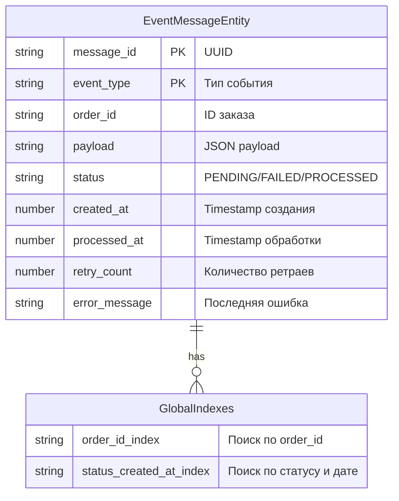
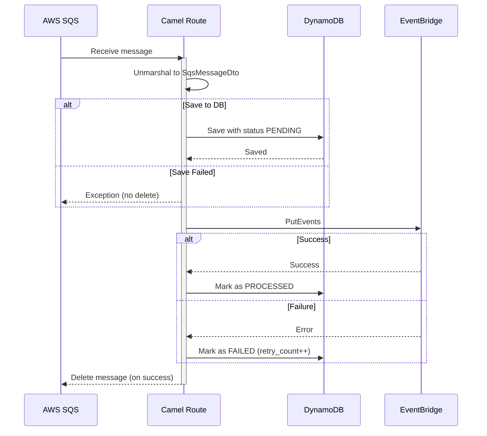
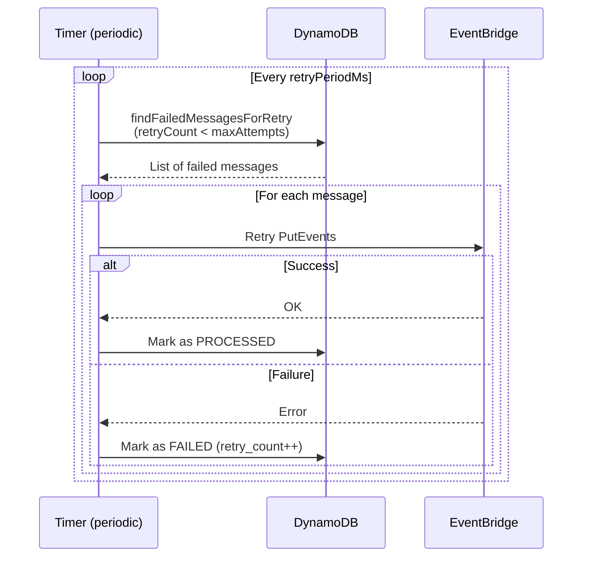
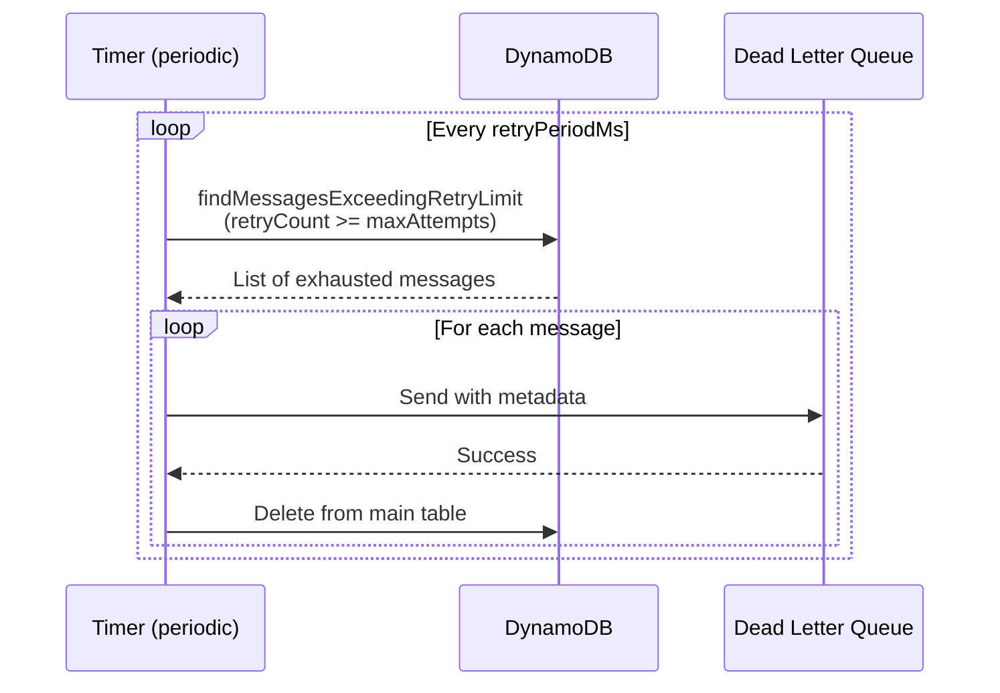
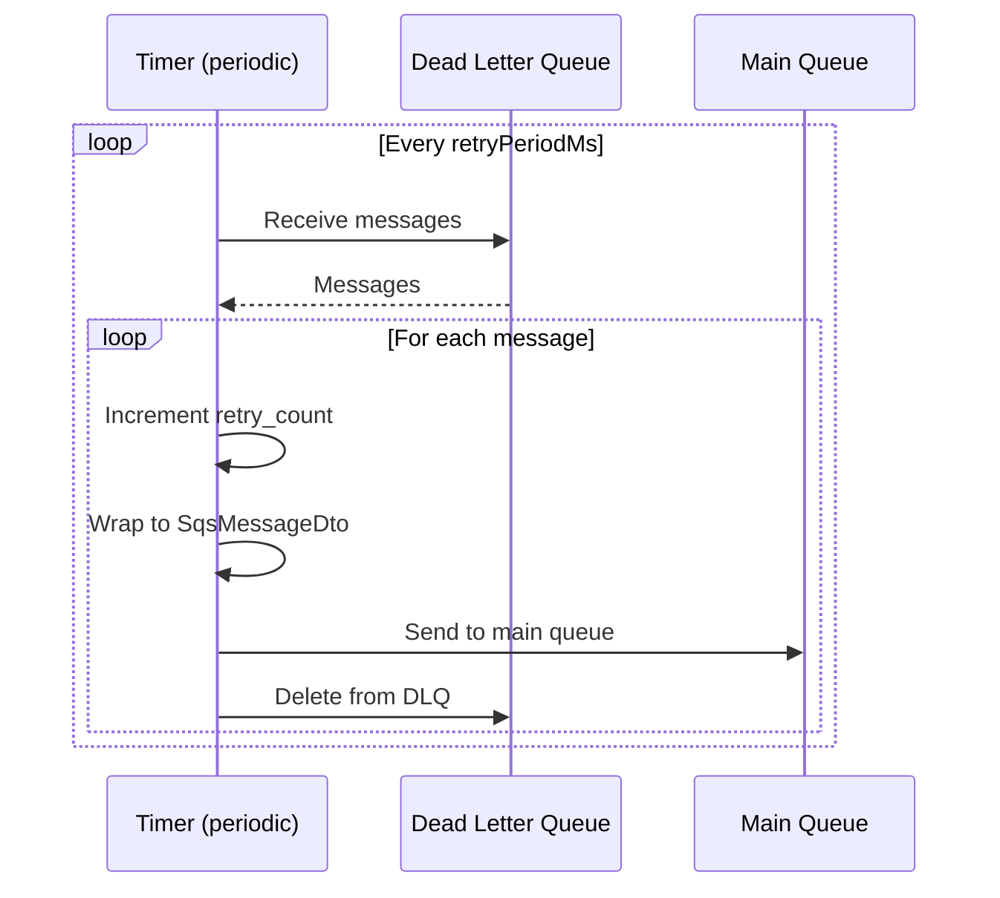
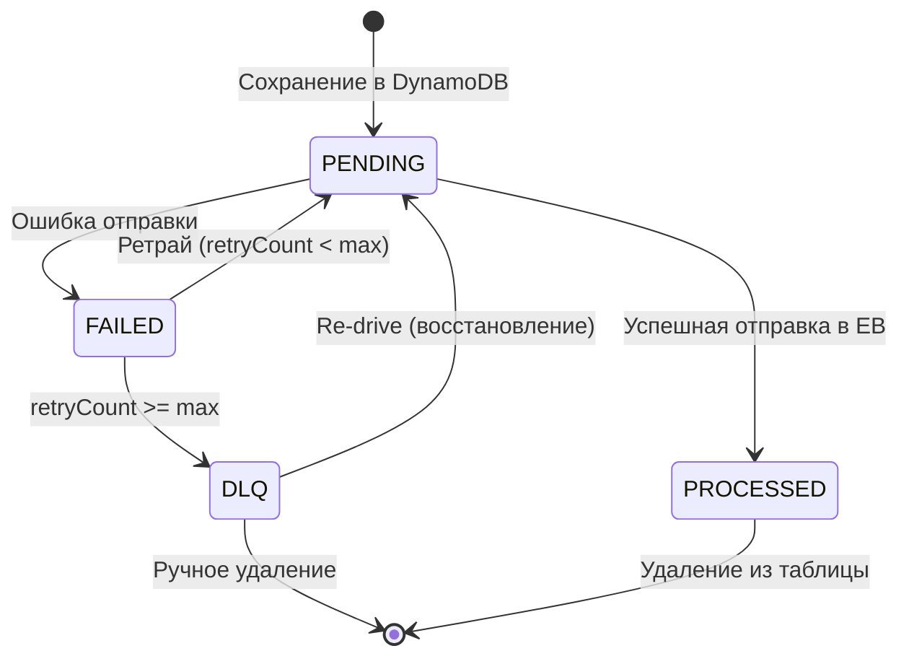

# Camel Routing

Приложение для надежной маршрутизации сообщений из AWS SQS в AWS EventBridge с поддержкой ретраев, Dead Letter Queue и автоматического восстановления.

## Модель данных (DynamoDB)



## Маршруты

### Основной маршрут



### Ретрай



### Отправка в DLQ



### Восстановление из DLQ



## Технологический стек

- **Java 21**
- **Quarkus 3.17.5** - фреймворк DI
- **Apache Camel** - библиотека для маршрутизации
- **AWS SDK** - библиотека для SQS, EventBridge, DynamoDB, Lambda, SES, KMS, IAM
- **Micrometer** - метрики
- **Mutiny** - библиотека для реактивной парадигмы
- **MapStruct, Lombok, Jackson** - утилитные библиотеки
- **LocalStack** - локальное AWS окружение

## Конфигурация приложения

Рекомендую осмотреть `env` файлик, а также `application.properties`

## Запуск проекта

### 1. Локальный запуск с LocalStack

```bash
cp .env.example .env

docker-compose up -d --build

./deploy-lambda.sh
```

### 2. Отправка тестового сообщения

```bash
aws --endpoint-url=http://localhost:4566 sqs send-message \
  --queue-url http://localhost:4566/000000000000/event-processor-queue-dev \
  --message-body '{
    "id": "msg-12345678-1234-1234-1234-123456789012",
    "type": "order.created",
    "timestamp": 1734567890123,
    "data": {
      "orderId": "ORD-12345",
      "amount": 1500.50,
      "customerId": "CUST-67890",
      "currency": "USD"
    },
    "metadata": {
      "source": "webapp",
      "version": "1.0",
      "retryCount": 0
    }
  }'
```

## Метрики

Написаны с помощью Jakarta interceptors. Пример метрик:

| Метрика | Описание |
|---------|----------|
| `dynamodb.save` | Время сохранения в DynamoDB |
| `dynamodb.find_failed_for_retry` | Время поиска failed сообщений |
| `dlq.messages.sent` | Количество сообщений, отправленных в DLQ |
| `dlq.redrive.success` | Количество успешно восстановленных сообщений |
| `dlq.redrive.failed` | Количество ошибок при восстановлении |

## CloudFormation

`template-app.yaml` реализует пример инфраструктуры для приложения, а `template-lambda.yaml` для орагнизации прав для лямбды

## Диаграмма состояний сообщения

